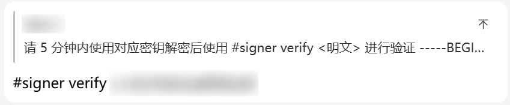

# Lagrange V2 Sign API 申请指南

Lagrange V2 Sign API 是**白名单制**，可通过特定的 QQ Bot 自助申请使用权限。流程如下：

首先，确保你的 GitHub 账户中添加了 GPG Key。在包含特定 QQ Bot 的群聊中，使用你的主 QQ 号发送如下内容：

```
#signer register <你的 GitHub 用户名> <你的 GPG Key ID>
```

随后，Bot 会提供一则使用 GPG 公钥加密的消息，你需要使用对应的 GPG 私钥进行解密，并将解密的字符串内容**在 5 分钟内**按照以下格式发送到群聊中：

```
#signer verify <解密后的字符串内容>
```

注意在发送 `verify` 命令时需要回复 Bot 的消息，并且回复时不能添加任何其他内容（包括 `@Bot`）。一个示例回复如下：



如果验证成功，Bot 会回复注册成功的消息，并且将 token 通过相同的 GPG 公钥加密后发送到群聊中。你需要使用 GPG 私钥解密后获取 token，并妥善保管这个 token，因为它是你后续使用签名 API 的唯一凭证。

> [!tip]
>
> 如果 Bot 成功接收到了你的请求，会给你的消息贴一个 `/续标识`（手指按红色按钮）的表情。你可以通过有没有这个表情来判断 Bot 是否成功接收了你的消息。

在 Bot 提示注册成功后，即可开始绑定实际用到签名的 QQ 号。每个 GitHub 账户对应 1 个主 QQ 号，并可以绑定至多 3 个子 QQ 号，即**实际使用签名的 QQ 号**。绑定方式为发送以下内容：

```
#signer bind <要绑定的 QQ 号>
```

主 QQ 号本身不具备签名使用权限，只有绑定的实际使用签名的 QQ 号才具备签名权限。主 QQ 号也可以绑定自身为子 QQ 号，这时主 QQ 号具备签名权限，但也会占用 1 个绑定名额。

如果绑定的子 QQ 号不再需要使用签名权限，可以通过以下命令解绑：

```
#signer unbind <要解绑的 QQ 号>
```

此外，可以通过如下方式查看目前已经绑定的 QQ 号列表：

```
#signer profile
```

